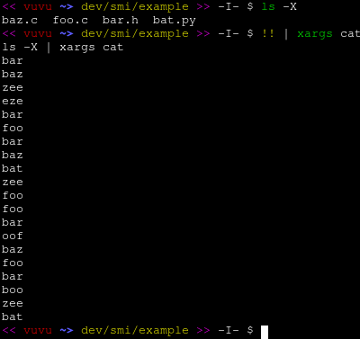
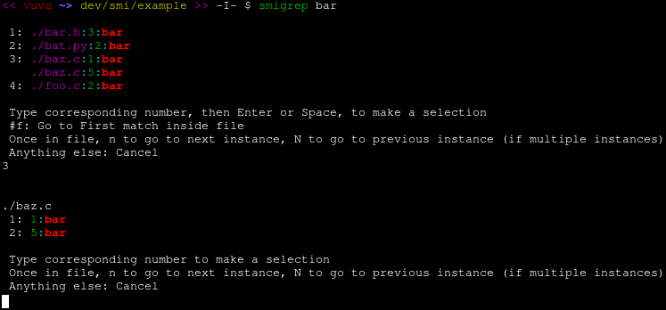
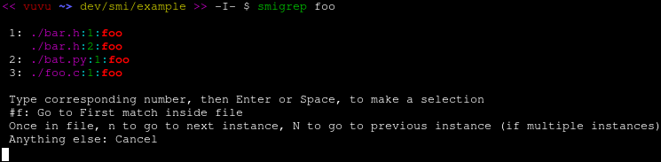
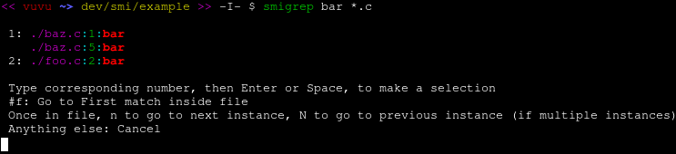
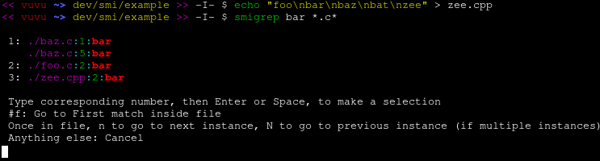
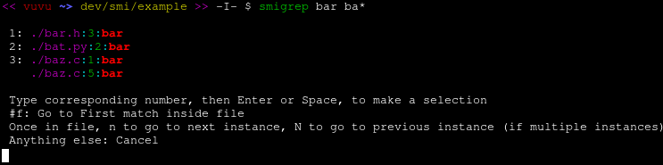
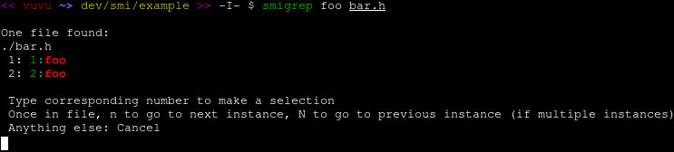
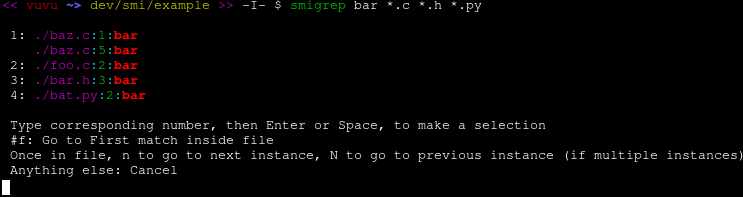
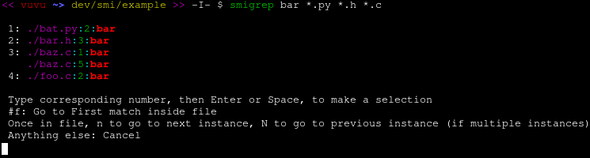
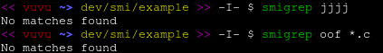

# SMIgrep
### Slightly More Interactive grep
##### Usage:
```$ smigrep searchstring [extension[s]]```
##### Example:
```$ smigrep myFunction *.c *.h```

# Purpose
A command line tool to make searching for strings in a project easier, faster, and better on the eyes

## Example Usage
For this example, we will use 4 files: baz.c, foo.c, bar.h, and bat.py - each with 5 lines.



SMIgrep can be used to search for a string in all files in a directory and all subdirectories.
Files that contain the string will appear with the string in context, and the user will be prompted to pick a file.
If multiple instances of the string exist in a file, the user may pick which instance to go to.



Once a file [and instance] is selected by the user, vim will automatically open the file to the selected instance.
Vim is opened using the +/{string} option, allowing the user to use n and N to go forward and backward between instances, respectively.

If the user does not want to select an instance and just instantly go into a file, the letter "f" may be typed after a file number to go to the first instance.




SMIgrep can be used to search for a string in all files that match a regex glob



More globbing ability





Can also just search one file for a string



What if there is only one match in one file?


SMIgrep can also take multiple file extensions.



If multiple file extensions are provided, SMIgrep will print the results in the order of which they were provided.



What if there are no matches?



Additionally, if you use bash and have SMIgrep aliased (alias smigrep='path/to/smigrep'), you can use SMIgrep on the vim command line:

```:!smigrep searchstring [extension[s]]```

The same applies if you use zsh, but you need your .zshenv set (cp ~/.zshrc ~/.zshenv) to make aliases in your .zshrc available in vim.
The noglob option must also be set (alias smigrep='noglob path/to/smigrep').

Enjoy! Feedback is always much appreciated :)
